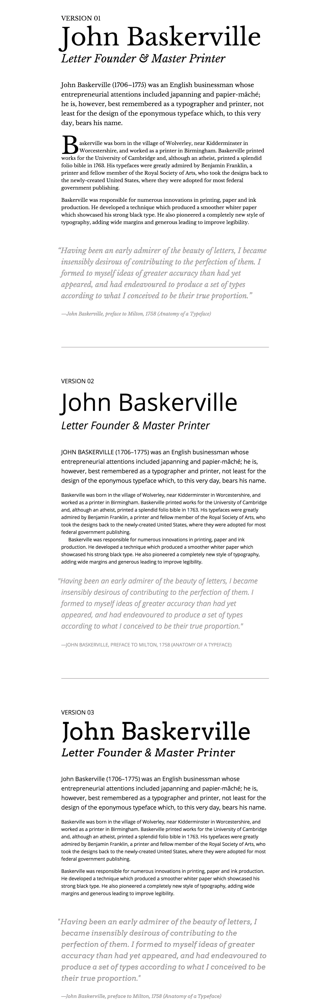

IXD101 Deliverables
===========================

This page is designed to give you a clear breakdown of the deliverables expected for the module. Deliverables for this module are broken into two main sections with a series of weekly deliverables for each section.

##Week 01-06 Paper 
Paper-based exercises introduce fundamental design principles developed at the Bauhaus, Ulm School of Design, and beyond.  

- **Week 02 - Deliverable 01 Dot** - Along with your paper exercises working with 1, 2, 3, 5 and 50 dots this weeks deliverable is to create a background screen for your smartphone using nothing but dots and circles. Try to avoid colour as much as possible.

- **Week 03 - Deliverable 02 Line** - Along with your paper exercises working with 1, 2, 3, 5 and 50 lines this weeks deliverable is to create a background screen for your laptop using nothing but lines. Again, try to avoid colour as much as possible.  

- **Week 04 - Deliverable 03 Plane** – Continue with your 1, 2, 3 and 9 planes + tone and a more finely executed 9 planes + tone piece. After the paper exercises work up some multiple planes; 20 ways on computer, you can use as may planes as you wish. 

- The final exercise for this week is to create a modular typeface built from planes. [Fontstruct](http://fontstruct.com) is an excellent tool to help you do this. Alternatively you could use Sketch or Illustrator.

- **Week 05 - Deliverable 04 Type** – Continue with your 1 'M' 20 ways, your two letters joined six ways and your kerning exercise. In addition to these, this weeks task is to create a movie poster in the style of [Josef Müller Brockmann](http://print-process.com/product/?product-id=1052). This - [JMB on Pinterest](https://www.pinterest.com/eleventhirty/jmb/) might also be useful.

- **Week 06 - Deliverable 05 Colour** – Take one of your previous projects and revisit it using colour. Consider how complimentary, analagous or primary/secondary colours affect the design.

##Week 07-12 Screen
###HTML
Using the story of John Baskerville as a starting point the screen-based exercises will ground students with a solid understanding of HTML5 and CSS3, the building blocks of web-based content.

- **Week 07 - Deliverable 06 HTML** – Taking the raw John Baskerville text as your starting point create a simple HTML5 page on GitHub. Save this as version1.html

- **Week 08 - Deliverable 07 HTML** – Add a nested, unordered list and save as version2.html and secondly add a simple navigation linking this with anchors to each section. Finally add an email link and an absolute link to an external website. Save this as version3.html

- **Week 09 - Deliverable 08 HTML** – This week you should have created two versions. The should replace your unordered list with a table while the second version should include properly optimised images.

###CSS
- **Week 10 - Deliverable 09 HTML** – This week we started to look at CSS and applied some proper styling to our well structured markup. Save this as version 6.

- This week we have an additional exercise. We would like to you take this [markup](resources/css-exercise.html) – and, using css, style it as closely as you can to the image below.

- **Week 11 – Deliverable 10 HTML** – This week we continued our exploration into CSS and applied a CSS reset and introduced a few media queries. Save this as version 7/8.

- **Week 12 – Deliverable 11 HTML** – To finish this section off we would like you to take what you have learnt this semester and redesign your Hello World page. This will, for some of you, be your first solid presence online and should be a means to show off what you know and what you have created. 
